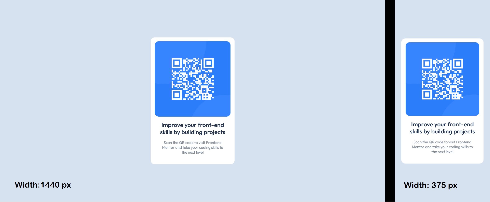

# Frontend Mentor - QR code component solution

This is a solution to the [QR code component challenge on Frontend Mentor](https://www.frontendmentor.io/challenges/qr-code-component-iux_sIO_H). Frontend Mentor challenges help you improve your coding skills by building realistic projects. 

## Table of contents

- [Overview](#overview)
  - [Screenshot](#screenshot)
  - [Links](#links)
- [My process](#my-process)
  - [Built with](#built-with)
- [Author](#author)

## Overview

This project consisted on a design of a card with a QR code that should be displayed in two different screen widths: 1440px and 375px

### Screenshot

### Links

- Solution URL: (https://github.com/PCGP22/Code-challenges/blob/main/QR%20component%20FEM)

## My process

Started with the HTML5 structure adding the favicon and the Qr image from the zip file.
Continued with the CSS styling:
-At first defining the variables from the styling guide (also from the zip file).
-Shortly after, resizing the container (".card") and the text elements.
-Decided to use flexbox for centering the content.
-Then adding the respective colors.
-Finally adding the media queries for responsiveness and refactoring the CSS styling.

### Built with

- Visual Studio Code
  - HTML5
  - CSS vanilla

- Principles:
  - Flexbox
  - Responsiveness
  - Desktop-first workflow
  - Media queries
  - BEM & DRY

## Author

Paulo Gutiérrez

- Frontend Mentor - [@PCGP22](https://www.frontendmentor.io/profile/PCGP22)
